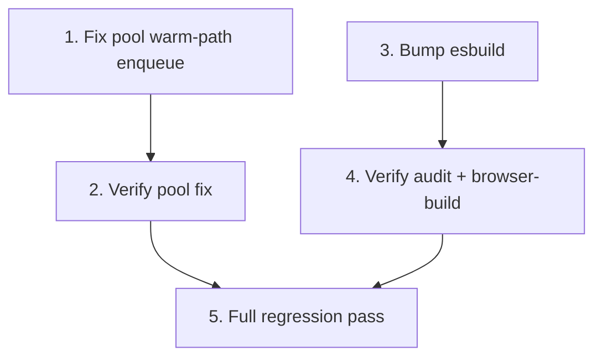

# Implementation Plan

## Overview

Two independent fixes, each followed by a verification task, plus a final
regression pass. Root cause A (the PgPool warm-path enqueue) is addressed by
tasks 1–2; root cause B (the esbuild advisory) by tasks 3–4; task 5 confirms the
combined result against the full Core suite. The two fixes are independent and
can be implemented in either order.

## Tasks

- [x] 1. Fix PgPool warm-path waiter enqueue
  - In `packages/core/src/database/pool.ts`, change `acquire()` so it only
    `await this.ensureInitialized()` on the cold path (`if (!this.initialized)`),
    calling `_doAcquire()` in the same tick on the warm path so waiters are
    enqueued synchronously.
  - Keep `_recordAcquire()` timing and the existing `_doAcquire()` /
    `close()` / `release()` logic unchanged.
  - Update the explanatory comment in `acquire()` so it matches the
    implementation (it currently describes the contract the old code violated).
  - _Requirements: 1.1, 1.2, 1.3, 2.1, 2.2, 2.3, 3.1, 3.2, 3.3, 3.4, 5.6_

- [x] 2. Verify the pool fix against the failing suites
  - Run `npm run build:app -w packages/core` to recompile.
  - Run `node --test packages/core/dist/tests/memory-leak.test.js packages/core/dist/tests/wire-protocol.test.js` and confirm all pass.
  - Run `node --test packages/core/dist/tests/system/memory-safety.test.js` and
    confirm all pass, including "throws synchronously when wait queue exceeds
    MAX_WAIT", "close rejects queued waiters", "release of unready connection
    does not consume waiter", and "acquire after close throws synchronously".
  - _Requirements: 5.1, 5.2, 5.6_

- [x] 3. Bump esbuild past the high-severity advisory
  - In `packages/core/package.json`, raise the `esbuild` devDependency range to
    the first patched line outside the advisory range (e.g. `^0.29.0` or the
    current patched latest), keeping it in `devDependencies`.
  - Run `npm install` to refresh `package-lock.json`.
  - _Requirements: 4.1, 4.2, 4.3, 4.4_

- [x] 4. Verify the audit and browser-build after the esbuild bump
  - Run `npm audit --audit-level=high` and confirm exit code 0.
  - Run the placeholder scan
    (`grep -RInE '\b(TODO|FIXME|HACK)\b|@ts-ignore' --include='*.ts' --exclude-dir=tests --exclude-dir=integration packages/core/src`)
    and confirm it reports nothing.
  - Rebuild and run the browser-build test
    (`node --test packages/core/dist/tests/browser-build.test.js`) to confirm the
    bumped esbuild's `build()` API still works; adjust the test call site only if
    the API changed.
  - _Requirements: 4.1, 5.4, 5.5_

- [-] 5. Full regression pass
  - Run `npm run build:app -w packages/core` then `npm run coverage -w packages/core`
    and confirm the Core suite completes with no failing tests.
  - Confirm no previously passing test regressed across the memory-leak,
    memory-safety, wire-protocol, and browser-build suites.
  - _Requirements: 5.1, 5.2, 5.3, 5.4, 5.6_

## Task Dependency Graph



Tasks 1→2 (pool fix) and 3→4 (esbuild fix) are independent chains and may run in
parallel. Task 5 depends on both verification tasks (2 and 4).

```json
{
  "waves": [
    { "wave": 1, "tasks": ["1", "3"] },
    { "wave": 2, "tasks": ["2", "4"] },
    { "wave": 3, "tasks": ["5"] }
  ],
  "dependencies": {
    "1": [],
    "2": ["1"],
    "3": [],
    "4": ["3"],
    "5": ["2", "4"]
  }
}
```

## Notes

- The fixes must not alter the `PgPool` public API, the `pool:exhausted` event,
  or timeout behavior (Requirement 5.6).
- `esbuild` stays a dev-only dependency; it is used solely by
  `browser-build.test.ts` and is not shipped at runtime (Requirement 4.4).
- All verification commands are read-only/local; no production or shared systems
  are touched.
