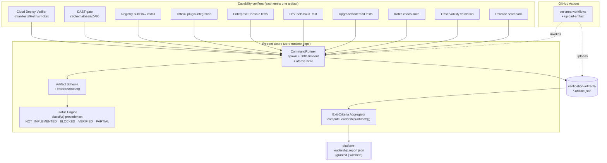
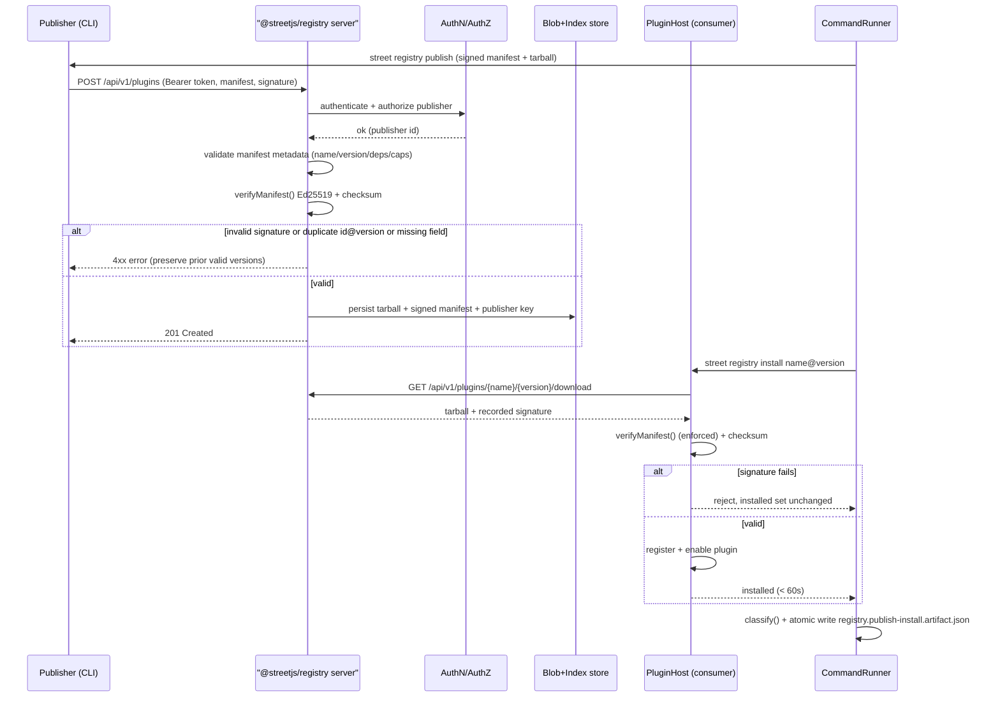
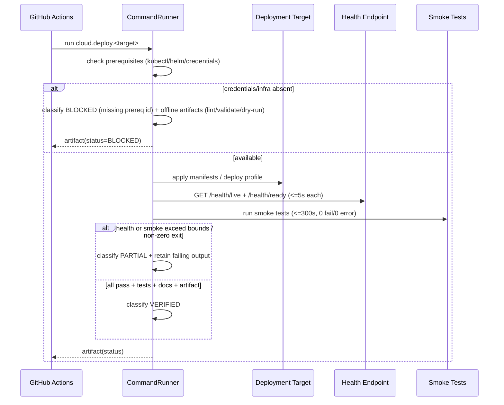

# Design Document

## Overview

This design specifies how the Street Framework closes the remaining **Platform Leadership Gaps** under a strict **zero-trust evidence standard**: no capability is "done" by assertion or estimation — only by a machine-readable **Verification Artifact** produced by an executed command. The design is organized around a single unifying subsystem (the **Verification Artifact subsystem**) into which all twelve requirement areas plug. Every area produces artifacts in one common schema; a single **Exit-Criteria Aggregator** reads those artifacts and computes the Platform Leadership classification mechanically.

The design is deliberately grounded in what already exists in the repository, and extends it rather than reinventing it:

- **Cloud deployment** builds on `packages/core/src/cloud/deployment.ts` (`generateManifest`, `validateDeploymentManifest`) and the proven kind-cluster path that achieved `/health/live` + `/health/ready` HTTP 200 with a `1/1 Running` pod.
- **DAST** extends `packages/core/src/security/dast.ts` (`openApiConformanceScan`, `parseZapReport`, `evaluateDastGate`, `summarizeFindings`) and the existing `.github/workflows/dast.yml` + `scripts/dast/*`.
- **Plugin registry** is built on the existing local primitives: `signManifest`/`verifyManifest`/`manifestChecksum` and `PluginHost` (`packages/core/src/platform/plugins/host.ts`), `LocalPluginRegistry`/`installFromRegistry` (`local-registry.ts`), and the `PluginInstaller` HTTP client (`registry.ts`).
- **Official plugins** build on `packages/core/src/platform/plugins/official/*` (s3, r2, sendgrid, twilio, stripe, auth0) and the `PluginModule` SDK.
- **Enterprise APIs** reuse `tenancy/*` (provisioner, pool-registry, context, billing, metrics) and `enterprise/*` (audit-logger, data-policy/ComplianceReporter, feature-flags, backup, storage-adapters).
- **Interactive DX** builds on `devx/playground.ts` (`openApiToHtml`) and the router's route table + the module dependency graph (`scripts/check-cycles.mjs` already walks imports).
- **Upgrade system** extends `devx/codemods.ts` (`applyCodemods`, `Codemod`, `renameIdentifierCodemod`) driven by the existing `street upgrade` CLI command.
- **Kafka reliability** extends `transports/kafka/client.ts` (`findCoordinator`, `awaitTopicReady`, coordinator-retry) and `scripts/reliability/kafka-cold-start.sh`.
- **Observability** extends `observability/prometheus*.ts` + `grafana-dashboard.ts` + `scripts/observability/emit-assets.mjs`.
- **Release engineering** extends `scripts/release.sh`, `scripts/validate-*.sh`, `CHANGELOG.md`, and the existing `certification-report.json`.

### Cross-cutting constraints honored throughout

| Constraint | How the design honors it |
|---|---|
| **Zero runtime deps for `@streetjs/core`** | All new *pure* logic (status engine, schema validators, exit aggregator, codemods, registry signing helpers, dashboard/alert validators) lives in core and uses **only Node core modules** (`node:crypto`, `node:fs`, `node:child_process`). Everything that needs third-party deps (the registry **server**, official plugin **vendor SDKs**, the **browser** devtools bundle, the **release** report renderer) lives in **separate packages** outside core. |
| **Security-first** | Every network surface introduced here declares an authn + authz model (registry publish, enterprise console, devtools). No unauthenticated mutating endpoint is introduced. |
| **Real-infrastructure testing** | VERIFIED requires execution against real containers/brokers/clusters. Mocks never yield VERIFIED. The Testing Strategy separates real-infra tests from offline-verifiable artifacts and defines how BLOCKED is recorded honestly. |
| **CI/CD integration** | Every verification is runnable from a GitHub Actions workflow and uploads its Verification Artifact via `actions/upload-artifact`. |
| **Docs on GitHub Pages** | All new docs are authored as Jekyll/just-the-docs pages under `docs/` and the devtools are embedded into the docs site. |
| **No completion estimates** | The aggregator computes status only from recorded artifacts; there is no hand-set percentage anywhere. |

### Package layout introduced by this design

```
packages/
  core/                     # zero-dep; pure verification logic + node-core runner + extended primitives
    src/verification/       # status engine, schema, command runner, exit aggregator (NEW)
    src/cloud/              # extend deployment.ts (lazy DB, more targets) (EXTEND)
    src/security/dast.ts    # extend findings → artifact (EXTEND)
    src/observability/      # extend dashboards/alerts/SLO + metric-reference guard (EXTEND)
    src/devx/codemods.ts    # add routing/middleware/plugin-API codemods (EXTEND)
    src/transports/kafka/   # add Coordinator Readiness Gate (EXTEND)
  cli/                      # `street verify`, `street upgrade` (analysis), `street registry`, `street release` (EXTEND)
  registry-server/          # @streetjs/registry — REST registry service (NEW, may use deps)
  devtools/                 # @streetjs/devtools — browser Playground/Explorer/Graph/Inspector (NEW, may use deps)
  plugin-redis/ plugin-s3/ plugin-r2/ plugin-twilio/ plugin-sendgrid/ plugin-stripe/ plugin-auth0/  (NEW packages, may use vendor SDKs)
scripts/
  verification/run.mjs      # generic capability runner → artifact (NEW)
  cloud/*                   # per-target deploy+smoke+report (NEW)
  release/*                 # scorecard + changelog/notes validation (NEW)
verification-artifacts/     # retained, machine-readable evidence (NEW, gitignored except samples)
```

---

## Architecture

### Component map — the evidence subsystem and how each area plugs in



The key architectural rule: **producers never write status by hand**. A producer runs its real command through `CommandRunner`, which captures stdout/stderr, exit code, timing, and timeout, then hands the result to the Status Engine, which assigns exactly one status and writes the artifact atomically. The Aggregator is the only thing that computes the Platform Leadership decision, and it reads only artifacts.

### Capability identifier scheme

Every capability has a stable, dotted identifier `area.capability[.target]`, e.g.:

```
cloud.deploy.kubernetes      dast.scan                     registry.publish-install
cloud.deploy.cloudrun        plugin.s3                     enterprise.api
cloud.deploy.ecs             plugin.stripe                 devx.playground
cloud.deploy.lambda          kafka.coldstart               devx.route-explorer
kafka.chaos.broker-restart   observability.validate        release.scorecard
```

The twelve Requirement-12 exit capabilities are a fixed subset of these identifiers (see Data Models → Exit-Criteria set). Identifiers are the join key between producers, artifacts, and the aggregator.

### Artifact directory layout

```
verification-artifacts/
  cloud/cloud.deploy.kubernetes.artifact.json
  cloud/deployment-report.json              # roll-up across targets (Req 2.11)
  dast/dast.scan.artifact.json
  registry/registry.publish-install.artifact.json
  plugins/plugin.s3.artifact.json ...
  enterprise/enterprise.api.artifact.json
  devx/devx.playground.artifact.json ...
  kafka/kafka.coldstart.artifact.json
  kafka/kafka.chaos.broker-restart.artifact.json ...
  observability/observability.validate.artifact.json
  release/release.scorecard.artifact.json
  platform-leadership.report.json           # aggregator output (Req 12.5)
```

Each `*.artifact.json` conforms to the single Verification Artifact schema (Data Models). Writes are **atomic**: the runner writes to `*.artifact.json.tmp-<pid>-<rand>` then `rename()`s over the target, so a reader never sees a partial file, and a failed write leaves no partial artifact (Req 1.11).

### Sequence — publish → install (registry) verification flow



### Sequence — deploy → verify (cloud) flow with honest BLOCKED



### Lazy database initialization (Requirement 2.12)

Today `bootstrap()` in `packages/core/src/main.ts` calls `await pool.initialize()` eagerly, so a deployment without a provisioned PostgreSQL fails to boot and never serves health. The design changes startup so the DB is **not required at bootstrap**:

- Introduce a `DB_INIT_MODE` config: `lazy` (default for cloud), `eager`, or `provisioned`.
- In `lazy` mode, `bootstrap()` registers the `PgPool` but does **not** call `initialize()`. The pool initializes on first acquire (`acquire()`/`query()` already create connections on demand). A `pool.ensureInitialized()` guard makes warm-up idempotent and lazy.
- The **readiness** check distinguishes liveness from DB-readiness: `/health/live` never depends on the DB; `/health/ready` reports the DB as a *declared provisioned dependency* — `up` when no DB is configured/expected, `down` only when a DB is configured but unreachable. This lets a no-DB deployment serve both endpoints 200 within 5s and complete startup within 30s.
- `provisioned` mode treats the DB as an external dependency that the platform guarantees; bootstrap proceeds without blocking and readiness gates on first successful connection.

This is the smallest change that satisfies 2.12 without weakening environments that *do* require a DB.

---

## Components and Interfaces

### 1. Verification Artifact subsystem (`packages/core/src/verification/`, zero-dep)

#### Status engine

```typescript
export type VerificationStatus = 'VERIFIED' | 'PARTIAL' | 'BLOCKED' | 'NOT_IMPLEMENTED';

/** The four evidence components a VERIFIED capability must have (Req 1.3/1.4). */
export interface EvidenceComponents {
  sourceCode: boolean;     // capability has source
  passingTests: boolean;   // tests executed and exited 0
  documentation: boolean;  // published docs exist
  artifact: boolean;       // a Verification Artifact was produced by a command
}

export interface BlockedReason {
  /** Identifier of the specific missing external prerequisite (Req 1.5/1.10). */
  missingPrerequisite: string;
  kind: 'service' | 'credential' | 'runtime' | 'timeout';
}

export interface ClassifyInput {
  hasSourceCode: boolean;
  evidence: EvidenceComponents;
  /** Set when an external prerequisite is unavailable. */
  blocked?: BlockedReason | null;
  /** The exit code of the executed verification command (Req 1.9). */
  commandExitCode: number;
  /** True if the command was killed for exceeding 300s (Req 1.10). */
  timedOut: boolean;
}

/**
 * Assign exactly one status using the REQUIRED precedence:
 *   NOT_IMPLEMENTED → BLOCKED → VERIFIED → PARTIAL  (Req 1.2)
 * Rules:
 *  - no source code            → NOT_IMPLEMENTED            (Req 1.6)
 *  - timedOut OR blocked set   → BLOCKED                    (Req 1.5/1.10)
 *  - all four evidence present AND exitCode === 0 → VERIFIED (Req 1.3)
 *  - otherwise (>=1 but <4, or non-zero exit)     → PARTIAL  (Req 1.4/1.9)
 * Pure & deterministic: same input always yields same status.
 */
export function classify(input: ClassifyInput): VerificationStatus;
```

#### Artifact schema + validator

```typescript
export interface VerificationArtifact {
  schemaVersion: 1;
  capabilityId: string;            // dotted identifier
  status: VerificationStatus;
  evidence: EvidenceComponents;    // present/absent for each component (Req 1.4)
  command: string;                 // the executed command (Req 1.7)
  exitCode: number;                // command exit code (Req 1.7/1.9)
  timestamp: string;               // ISO-8601 (Req 1.7)
  durationMs: number;
  timedOut: boolean;
  blockedReason?: BlockedReason;   // present iff status === 'BLOCKED'
  /** Area-specific, schema-validated payload (counts, params, reports). */
  details?: Record<string, unknown>;
  /** Producer is a command, never hand-authored (Req 1.8) — enforced by `generator`. */
  generator: { tool: string; version: string };
}

export interface ArtifactValidationResult { valid: boolean; errors: string[]; }
export function validateArtifact(a: unknown): ArtifactValidationResult;
```

#### Command runner (node-core only: `child_process`, `fs`, `crypto`)

```typescript
export interface RunOptions {
  capabilityId: string;
  command: string;            // shell command to execute
  args?: string[];
  cwd?: string;
  env?: Record<string, string>;
  timeoutMs?: number;         // default 300_000 (Req 1.10)
  /** Static facts the runner cannot infer (docs present? source present?). */
  evidenceHints?: Partial<EvidenceComponents>;
  /** Prerequisite probes; if any returns missing, classify BLOCKED. */
  prerequisites?: Array<() => Promise<BlockedReason | null>>;
  outDir: string;             // verification-artifacts/<area>/
}

export interface RunResult { artifact: VerificationArtifact; path: string; }

/**
 * Execute `command`, enforce the 300s timeout (SIGKILL on overrun), collect
 * exit code/timing, run prerequisite probes, call classify(), then write the
 * artifact ATOMICALLY (tmp file + rename). If the write target cannot be
 * written, throw and leave NO partial artifact, and propagate a non-zero exit
 * (Req 1.11).
 */
export class CommandRunner {
  run(opts: RunOptions): Promise<RunResult>;
  /** Atomic write helper: write tmp then rename; never leaves a partial file. */
  static writeArtifactAtomic(path: string, a: VerificationArtifact): Promise<void>;
}
```

#### Exit-criteria aggregator (pure)

```typescript
/** The fixed set of capabilities Req 12.1 requires to be VERIFIED. */
export const PLATFORM_LEADERSHIP_CAPABILITIES: readonly string[];

export interface CapabilityStatus { capabilityId: string; status: VerificationStatus; hasArtifact: boolean; }

export interface LeadershipReport {
  decision: 'GRANTED' | 'WITHHELD';
  required: CapabilityStatus[];          // each required capability + its status
  withheld: CapabilityStatus[];          // non-VERIFIED or missing-artifact ones (Req 12.2/12.3)
  timestamp: string;                     // ISO-8601 (Req 12.5)
  computedFrom: string[];                // artifact file paths read (provenance)
}

/**
 * Compute the Platform Leadership decision SOLELY from recorded artifacts
 * (Req 12.4). A required capability with no artifact is treated as not VERIFIED
 * (Req 12.3). GRANTED iff every required capability is VERIFIED (Req 12.1),
 * else WITHHELD with the offending capabilities (Req 12.2).
 */
export function computeLeadership(artifacts: VerificationArtifact[]): LeadershipReport;
```

The CLI surface is `street verify <capabilityId>` (drives `CommandRunner`) and `street verify --aggregate` (drives `computeLeadership`, writes `platform-leadership.report.json`).

### 2. Cloud Deployment Verifier

Extends `cloud/deployment.ts`. New target coverage and a Helm chart + report generator:

```typescript
export type DeploymentTarget =
  | 'kubernetes' | 'cloudrun' | 'ecs' | 'lambda'
  | 'azure-functions' | 'gcf' | 'cloudflare-workers';

export interface SmokeResult { passed: number; failed: number; errored: number; durationMs: number; output: string; }

export interface TargetVerification {
  target: DeploymentTarget;
  status: VerificationStatus;
  health: { live: boolean; ready: boolean; maxLatencyMs: number };
  smoke?: SmokeResult;
  blockedReason?: BlockedReason;
}

/** Roll-up across all configured targets (Req 2.11). */
export interface DeploymentReport {
  timestamp: string;
  targets: TargetVerification[];
}

/** Generate the per-target deliverables (manifests/profiles/workflows + smoke). */
export function generateTargetAssets(target: DeploymentTarget, cfg: DeployConfig): Record<string, string>;

/** Build the deployment verification report from per-target results. */
export function buildDeploymentReport(results: TargetVerification[]): DeploymentReport;
```

Per-target deliverables:

| Target | Deliverables |
|---|---|
| Kubernetes | production manifests (extend `generateKubernetes`), **Helm chart** (`deploy/helm/street/`), liveness+readiness probes, **HPA autoscaling example**, smoke tests, kind-cluster verify script |
| Cloud Run | `service.yaml` profile (extend `generateCloudRun`), health validation, CI verify job |
| ECS Fargate | task definition + **service** definition (extend `generateEcs`), smoke tests |
| AWS Lambda | deploy workflow + handler adapter + cold-start validation test |
| Azure Functions | deploy workflow + function host config + validation tests |
| Google Cloud Functions | deploy workflow + entrypoint adapter + validation tests |
| Cloudflare Workers | deploy workflow (`wrangler`) + Worker adapter (`@streetjs/edge`) + validation tests |

Offline-verifiable artifacts (provable without credentials): `validateDeploymentManifest()` over generated manifests, `helm lint`, `helm template` schema checks, `wrangler deploy --dry-run`, task-def JSON schema validation, workflow lint. When credentials are absent, the target is **BLOCKED** with the missing credential id, but these offline artifacts still run and are recorded so progress is provable.

### 3. DAST verifier (extends `security/dast.ts`)

The existing `evaluateDastGate`/`summarizeFindings`/`parseZapReport`/`openApiConformanceScan` are reused. New: an artifact emitter and an expanded route surface (`dast/routes.json` grows to cover auth, RBAC-protected, file upload, and CRUD endpoints).

```typescript
export interface DastArtifactDetails {
  counts: Record<DastSeverity, number>;      // Critical/High/Medium/Low/Info (Req 3.7)
  endpointsScanned: number;
  endpointsTotal: number;                     // 100% coverage check (Req 3.2)
  gate: { failOn: DastSeverity; passed: boolean };
  failureCause?: 'target-unavailable' | 'scan-error' | 'timeout'; // Req 3.8/3.9
  tools: string[];                            // ['schemathesis','zap-baseline','zap-api']
}

/** Build a DAST Verification Artifact from collected findings + run metadata. */
export function buildDastArtifact(
  findings: DastFinding[],
  meta: { endpointsScanned: number; endpointsTotal: number; failureCause?: DastArtifactDetails['failureCause'] },
  gateOpts?: DastGateOptions,
): VerificationArtifact;
```

Behavior: High or Critical findings ⇒ gate fails the build, cause indicated (Req 3.4/3.5). Zero High/Critical ⇒ pass (Req 3.6). Target unavailable / scan failure ⇒ build fails with cause in artifact (Req 3.8). >30 min ⇒ scan terminated (workflow `timeout-minutes: 30` plus an in-script watchdog), build fails, timeout recorded (Req 3.9).

### 4. Network Plugin Registry (`packages/registry-server/`, may use deps; built on core signing)

REST API (all paths under `/api/v1`). AuthN: bearer token (publisher API key, hashed at rest); AuthZ: publisher may only publish under names in its owned namespace; reads are public.

```typescript
// Reuses core: verifyManifest, manifestChecksum, PluginManifest, signManifest
export interface RegistryApi {
  // Publish — authenticated + authorized; validates manifest + Ed25519 (Req 4.1/4.2/4.5/4.9/4.10)
  'POST   /api/v1/plugins': (req: PublishRequest) => PublishResponse | RegistryError;
  // Download — returns package + recorded signature (Req 4.1/4.3)
  'GET    /api/v1/plugins/:name/:version/download': () => PackageWithSignature | RegistryError;
  // Verify — re-checks integrity/signature on demand (Req 4.1)
  'GET    /api/v1/plugins/:name/:version/verify': () => VerifyResponse;
  // Search — query + category + tag filters, paginated (Req 4.1/4.6)
  'GET    /api/v1/plugins/search': (q: SearchQuery) => Paginated<PluginSummary>;
  // List — paginated, default 25 / max 100 (Req 4.1/4.6)
  'GET    /api/v1/plugins': (q: ListQuery) => Paginated<PluginSummary>;
  // Version history (Req 4.6)
  'GET    /api/v1/plugins/:name/versions': () => PluginVersion[];
}

export interface SearchQuery { q?: string; category?: string; tag?: string; page?: number; pageSize?: number; }
export interface Paginated<T> { items: T[]; page: number; pageSize: number; total: number; }

/** Clamp pagination to bounds: pageSize defaults 25, max 100, min 1 (Req 4.6). */
export function normalizePageSize(requested: number | undefined): number; // pure, in core

export interface PublishRequest { manifest: PluginManifest; publicKeyPem: string; tarballBase64: string; }
export interface RegistryError { code: 'UNAUTHENTICATED'|'UNAUTHORIZED'|'INVALID_MANIFEST'|'DUPLICATE'|'INTEGRITY_FAILED'; message: string; field?: string; }
```

Storage: signed manifest + publisher public key + tarball blob + indexed metadata (name, version, categories, tags, version history). On publish: authenticate → authorize → validate manifest metadata (`name`, `version`, declared `dependencies`, declared `capabilities`) → `verifyManifest()` (Ed25519 + checksum). Reject (preserving prior valid versions) on integrity failure, duplicate `name@version`, missing/malformed field (Req 4.4/4.10). The `street registry publish|install|search|list` CLI commands drive it; an end-to-end publish→install harness (real running server in a container) emits `registry.publish-install.artifact.json` (Req 4.8).

### 5. Official Plugin Ecosystem (`packages/plugin-*`, may use vendor SDKs)

Each official plugin is its own package with a uniform structure:

```
packages/plugin-<id>/
  src/index.ts            # class extends PluginModule (core SDK)
  manifest.json           # PluginManifest (name/version/capabilities/permissions/deps)
  manifest.signed.json    # signManifest() output (Ed25519) — produced by build
  tests/integration.test.ts  # runs against REAL backing service / container
  README.md               # docs (published to Pages)
  example/                # runnable example app
```

Coverage: storage = Redis, S3, R2; messaging = Twilio, SendGrid; payments = Stripe; identity = Auth0 (Req 5.1–5.4). Install path goes **through the registry** with signature verification **enforced** by `PluginHost` (`publicKey` set ⇒ `register()` throws `PluginSignatureError` on bad signature, leaving the installed set unchanged — Req 5.7). Missing/malformed manifest ⇒ reject with identifying error (Req 5.8). A valid signed plugin installs in < 60s and registers (Req 5.6). Each plugin's integration test runs against its real backing service (Redis/S3/R2 via containers; Stripe/Twilio/SendGrid/Auth0 via sandbox/test accounts — **BLOCKED** with recorded prerequisite when no test credential is present) and emits `plugin.<id>.artifact.json` with pass result, plugin id, ISO-8601 timestamp (Req 5.9).

### 6. Enterprise Console APIs (`packages/core/src/enterprise/console/`, zero-dep handlers; reuse tenancy/enterprise)

REST surface, all operations behind authn + authz middleware (reuse `http/auth.middleware.ts`, `security/jwt.ts`, RBAC from `data-policy`/`feature-flags`):

```typescript
export interface EnterpriseConsoleApi {
  // Tenant (reuse tenancy/provisioner TenantServiceImpl, pool-registry)
  'POST   /api/admin/tenants': CreateTenant;        // Req 6.1
  'PATCH  /api/admin/tenants/:id': UpdateTenant;     // Req 6.1
  'POST   /api/admin/tenants/:id/suspend': SuspendTenant; // Req 6.1
  // Policy (RBAC, MFA, retention, classification) — reuse data-policy decorators
  'PUT    /api/admin/policies/rbac': SetRbacPolicy;        // Req 6.2
  'PUT    /api/admin/policies/mfa': SetMfaPolicy;          // Req 6.2
  'PUT    /api/admin/policies/retention': SetRetention;    // Req 6.2
  'PUT    /api/admin/policies/classification': SetClassification; // Req 6.2
  // Compliance — reuse enterprise/audit-logger + data-policy/ComplianceReporter
  'GET    /api/admin/compliance/audit-export': ExportAudit;    // Req 6.3
  'GET    /api/admin/compliance/report': GenerateComplianceReport; // Req 6.3
  'GET    /api/admin/compliance/posture': SecurityPosture;     // Req 6.3
  // Admin — users, key rotation, secrets (reuse cloud/secret-providers SecretRotationManager)
  'POST   /api/admin/users': ManageUser;            // Req 6.4
  'POST   /api/admin/keys/rotate': RotateKey;        // Req 6.4
  'PUT    /api/admin/secrets/:name': ManageSecret;   // Req 6.4
}
```

Every handler: authenticate (401 on failure — Req 6.6) → authorize (403 on failure — Req 6.7) → validate input (reject + identify invalid input, leave all state unchanged — Req 6.8) → perform. A generated OpenAPI spec (via the framework's `openApiSpec()`) + published docs cover every operation (Req 6.9). The test suite runs against a running instance and emits `enterprise.api.artifact.json` with command, exit code, and pass/fail counts (Req 6.10).

### 7. Interactive Developer Experience (`packages/devtools/`, browser bundle, may use deps)

Builds on core's `openApiToHtml` and framework-sourced data:

```typescript
/** Route tree sourced from the router's registered routes (method + path). */
export interface RouteNode { method: string; path: string; children?: RouteNode[]; }
export function buildRouteTree(app: StreetApp): RouteNode[];   // Req 7.2

/** Module dependency graph (reuse import-walk logic from scripts/check-cycles.mjs). */
export interface DepGraph { nodes: string[]; edges: Array<[string, string]>; }
export function buildDependencyGraph(entry: string): DepGraph; // Req 7.3

/** API Inspector renders status/headers/body; on failure shows error + retains input. */
export interface InspectorResult { ok: boolean; status?: number; headers?: Record<string,string>; body?: string; error?: string; }
```

Four tools delivered as a browser experience embedded into the Pages docs site: **Playground** (route/middleware/plugin testing + OpenAPI viewer — Req 7.1), **Route Explorer** (visual route tree — Req 7.2), **Dependency Graph Visualizer** (nodes/edges — Req 7.3), **API Inspector** (status/headers/body; on failure shows error and retains the submitted request input — Req 7.4/7.5). The tools declare and enforce an authn+authz model (token-gated access; read-only against the inspected app) (Req 7.7). Build + test emit `devx.playground.artifact.json`, `devx.route-explorer.artifact.json`, `devx.dependency-graph.artifact.json` (Req 7.9).

### 8. Upgrade System (extends `devx/codemods.ts` + `street upgrade`)

```typescript
export interface VersionResolution { installed: string; target: string; }
/** Detect installed version + resolve target (default: latest) (Req 8.1/8.2). */
export function resolveVersions(opts: { targetArg?: string; latest: string; installed: string | null }): VersionResolution;

export type BreakingArea = 'routing' | 'middleware' | 'plugin-api';
export interface BreakingChange {
  id: string;
  area: BreakingArea;                 // Req 8.3
  fromVersion: string; toVersion: string;
  description: string;
  codemodId?: string;                 // present iff an automated codemod exists (Req 8.3/8.4)
  recommendation: string;             // required source change (Req 8.4)
}

/** Analyze breaking changes between installed and target (Req 8.3). */
export function analyzeBreakingChanges(r: VersionResolution): BreakingChange[];

/** Codemods for routing, middleware, and plugin-API migrations (Req 8.5). */
export const ROUTING_CODEMODS: Codemod[];
export const MIDDLEWARE_CODEMODS: Codemod[];
export const PLUGIN_API_CODEMODS: Codemod[];

/** A codemod that cannot parse / would conflict leaves the file unchanged and
 *  reports the reason (Req 8.7). Re-applying an applied codemod is a no-op
 *  (byte-for-byte unchanged) (Req 8.6). */
export interface CodemodApplication { file: string; changed: boolean; skipped?: { reason: string }; }
```

The codemod engine's existing contract (pure source→source, deterministic change count) already gives idempotence for `renameIdentifierCodemod` (re-running finds zero matches). New routing/middleware/plugin-API codemods follow the same pure contract so re-application is a no-op. `street upgrade` reports breaking changes + recommendations, and the codemod test suite emits `upgrade.codemods` artifact (Req 8.8).

### 9. Kafka Reliability — Coordinator Readiness Gate + Chaos

```typescript
export interface CoordinatorGateResult {
  ready: boolean;
  findCoordinatorOk: boolean;
  offsetsTopicStable: boolean;       // __consumer_offsets exists, every partition has a live leader
  waitedMs: number;
  offsetsPreserved: boolean;         // committed offsets untouched on failure (Req 9.2)
}

/**
 * Before consuming, wait up to 30s for a successful FindCoordinator AND
 * __consumer_offsets stability (topic exists, every partition has a live
 * leader). On timeout: do not begin consuming; preserve committed offsets
 * (Req 9.1/9.2). Built on KafkaClient.findCoordinator + metadata partition
 * leader checks (mirrors awaitTopicReady).
 */
export class CoordinatorReadinessGate {
  constructor(client: KafkaClient, opts?: { timeoutMs?: number; group: string });
  await(): Promise<CoordinatorGateResult>;
}
```

Chaos framework (extends `scripts/reliability/kafka-cold-start.sh`) adds scenarios: broker restart (exists), **network interruption** (pause/cut container networking, e.g. `docker network disconnect` / `tc`/`iptables`), connection loss, **slow broker** (inject ≥ 5000 ms delay via a proxy such as toxiproxy or `tc` latency) (Req 9.3). Parameterized inputs `COLD_STARTS` / `RESTART_CYCLES` support the full-scale targets (100 / 100) (Req 9.8). A **lost message** is defined as *a produced message never delivered to a committed consumer*; the harness accounts produced vs. committed-and-delivered counts. The artifact `kafka.coldstart` / `kafka.chaos.*` records parameter values, pass count, lost-message count, ISO-8601 timestamp (Req 9.4–9.8).

### 10. Advanced Observability (extends `observability/*`)

**Metrics first (Req 10.1/10.2).** New exported metrics are instrumented before any dashboard/alert references them:

| Subsystem | New Exported Metrics (sourced from real instrumentation) |
|---|---|
| PostgreSQL | `db_pool_connections{state}` (exists), `db_query_duration_seconds` (histogram, from `PgPool.query`), `db_pool_acquire_seconds` (from `PgPool.avgAcquireMs`/acquire path), `db_pool_exhausted_total` (from `pool:exhausted` event) |
| Kafka | `kafka_messages_produced_total`, `kafka_messages_consumed_total`, `kafka_consumer_lag` (high-watermark − committed), `kafka_coordinator_wait_seconds` (from CoordinatorReadinessGate) |
| RabbitMQ | `rabbitmq_messages_published_total`, `rabbitmq_messages_delivered_total`, `rabbitmq_queue_depth`, `rabbitmq_consumer_count` |
| Plugin Host | `plugin_host_plugins{state}` (registered/enabled/disabled), `plugin_install_duration_seconds`, `plugin_signature_failures_total` |

```typescript
/** Set of metric names the app actually exports (parsed from /metrics or the registry). */
export function exportedMetricNames(registry: MetricsRegistry): Set<string>;

/** Extract every metric referenced by a dashboard/alert expr. */
export function referencedMetrics(assets: { dashboards: GrafanaDashboard[]; rules: RuleGroup[] }): Set<string>;

/** Anti-fabrication guard: FAIL if any referenced metric is not exported
 *  (Req 10.1/10.7). Returns the offending metric+asset pairs. */
export interface MetricReferenceViolation { metric: string; asset: string; }
export function validateMetricReferences(
  exported: Set<string>, assets: { dashboards: GrafanaDashboard[]; rules: RuleGroup[] },
): MetricReferenceViolation[];
```

New dashboards: PostgreSQL, Kafka, RabbitMQ, HTTP (exists), Plugin Host (Req 10.3). New alerts with numeric thresholds + windows: latency, error rate, queue depth, memory pressure (Req 10.4). SLO pack: availability, latency, error budget with numeric targets + windows (extends `streetSloBurnRateRules`) (Req 10.5). Validation pipeline: `validateMetricReferences` (anti-fabrication, fails recording the offending metric+asset), `validatePrometheusRuleGroups`, `validateGrafanaDashboard`, and **promtool** over emitted rule files (Req 10.6/10.7/10.8). Emits `observability.validate.artifact.json` with command, exit code, ISO-8601 timestamp (Req 10.9).

### 11. Release Engineering (`packages/cli` + `scripts/release/`, may use deps for rendering)

```typescript
export interface ReleaseScorecard {
  security: number; reliability: number; coverage: number; performance: number; // each 0–100 (Req 11.1)
}

export interface HealthMetrics {
  dependencyFreshness: { count: number; deltaVsPrevious: number };  // Req 11.4
  testTrends: { count: number; deltaVsPrevious: number };
  vulnerabilityTrends: { count: number; deltaVsPrevious: number };
}

export interface ReleaseReport {
  version: string;
  scorecard: ReleaseScorecard;
  validation: { semverOk: boolean; releaseNotesOk: boolean; failedControl?: string }; // Req 11.2/11.3
  health: HealthMetrics;
  timestamp: string;
}

/** Validate semver MAJOR.MINOR.PATCH (Req 11.2). Pure. */
export function isValidSemver(version: string): boolean;
/** Validate the release notes contain a non-empty entry for `version` (Req 11.2). */
export function validateReleaseNotes(changelog: string, version: string): boolean;
/** Build the release report; CI fails (non-zero) when an enforced control fails (Req 11.3/11.6). */
export function buildReleaseReport(input: ReleaseReportInput): ReleaseReport;
```

CI enforcement: a `release-engineering` workflow (or extension of `ci-cd-enforcement.yml`) runs `buildReleaseReport`, emits `release.scorecard.artifact.json` (Req 11.1/11.5), and fails the release with a non-zero exit when semver/notes validation fails or an enforced control is unsatisfied (Req 11.3/11.6). `isValidSemver`/`validateReleaseNotes` are pure and live in core (zero-dep); report rendering may live in the CLI/scripts package.

### 12. Exit-criteria engine

Covered by the aggregator in section 1. `street verify --aggregate` reads all artifacts under `verification-artifacts/`, calls `computeLeadership`, and writes `platform-leadership.report.json`. The decision is never hand-set (Req 12.4); a missing artifact for a required capability forces WITHHELD (Req 12.3).

---

## Data Models

### Verification Artifact (JSON Schema, the single evidence record)

```json
{
  "$schema": "https://json-schema.org/draft/2020-12/schema",
  "title": "VerificationArtifact",
  "type": "object",
  "required": ["schemaVersion", "capabilityId", "status", "evidence", "command", "exitCode", "timestamp", "generator"],
  "additionalProperties": false,
  "properties": {
    "schemaVersion": { "const": 1 },
    "capabilityId": { "type": "string", "pattern": "^[a-z0-9]+(\\.[a-z0-9-]+)+$" },
    "status": { "enum": ["VERIFIED", "PARTIAL", "BLOCKED", "NOT_IMPLEMENTED"] },
    "evidence": {
      "type": "object",
      "required": ["sourceCode", "passingTests", "documentation", "artifact"],
      "properties": {
        "sourceCode": { "type": "boolean" },
        "passingTests": { "type": "boolean" },
        "documentation": { "type": "boolean" },
        "artifact": { "type": "boolean" }
      }
    },
    "command": { "type": "string", "minLength": 1 },
    "exitCode": { "type": "integer" },
    "timestamp": { "type": "string", "format": "date-time" },
    "durationMs": { "type": "integer", "minimum": 0 },
    "timedOut": { "type": "boolean" },
    "blockedReason": {
      "type": "object",
      "required": ["missingPrerequisite", "kind"],
      "properties": {
        "missingPrerequisite": { "type": "string", "minLength": 1 },
        "kind": { "enum": ["service", "credential", "runtime", "timeout"] }
      }
    },
    "details": { "type": "object" },
    "generator": {
      "type": "object",
      "required": ["tool", "version"],
      "properties": { "tool": { "type": "string" }, "version": { "type": "string" } }
    }
  },
  "allOf": [
    { "if": { "properties": { "status": { "const": "BLOCKED" } } },
      "then": { "required": ["blockedReason"] } }
  ]
}
```

### Platform Leadership Exit-Criteria set + report

```jsonc
// PLATFORM_LEADERSHIP_CAPABILITIES (Req 12.1) — fixed, the only inputs to the gate
[
  "dast.scan",
  "cloud.deploy",                 // roll-up VERIFIED iff deployment-report all-targets VERIFIED
  "registry.publish-install",
  "plugins.ecosystem",            // roll-up VERIFIED iff every official plugin VERIFIED
  "enterprise.api",
  "devx.playground",
  "devx.route-explorer",
  "devx.dependency-graph",
  "kafka.chaos",                  // roll-up VERIFIED iff coldstart + all chaos scenarios VERIFIED
  "observability.validate",
  "release.scorecard"
]
```

```json
// platform-leadership.report.json (Req 12.5)
{
  "decision": "WITHHELD",
  "timestamp": "2025-01-01T00:00:00.000Z",
  "required": [
    { "capabilityId": "dast.scan", "status": "VERIFIED", "hasArtifact": true },
    { "capabilityId": "cloud.deploy", "status": "PARTIAL", "hasArtifact": true },
    { "capabilityId": "registry.publish-install", "status": "VERIFIED", "hasArtifact": true }
  ],
  "withheld": [
    { "capabilityId": "cloud.deploy", "status": "PARTIAL", "hasArtifact": true }
  ],
  "computedFrom": ["verification-artifacts/dast/dast.scan.artifact.json", "..."]
}
```

### Plugin Manifest (extends core `PluginManifest`; registry-validated)

```json
{
  "title": "PluginManifest",
  "type": "object",
  "required": ["name", "version", "checksum", "signature"],
  "properties": {
    "name": { "type": "string", "pattern": "^(@[a-z0-9-]+/)?[a-z0-9-]+$" },
    "version": { "type": "string", "pattern": "^\\d+\\.\\d+\\.\\d+" },
    "capabilities": { "type": "array", "items": { "type": "string" } },
    "permissions": { "type": "array", "items": { "enum": ["middleware","events","net","fs","db","secrets"] } },
    "dependencies": { "type": "object", "additionalProperties": { "type": "string" } },
    "categories": { "type": "array", "items": { "type": "string" } },
    "tags": { "type": "array", "items": { "type": "string" } },
    "checksum": { "type": "string", "pattern": "^[0-9a-f]{64}$" },
    "signature": { "type": "string" }
  }
}
```

### Breaking-change descriptor (Upgrade System)

```json
{
  "title": "BreakingChange",
  "type": "object",
  "required": ["id", "area", "fromVersion", "toVersion", "description", "recommendation"],
  "properties": {
    "id": { "type": "string" },
    "area": { "enum": ["routing", "middleware", "plugin-api"] },
    "fromVersion": { "type": "string" },
    "toVersion": { "type": "string" },
    "description": { "type": "string" },
    "codemodId": { "type": "string" },
    "recommendation": { "type": "string" }
  }
}
```

### Release Scorecard

```json
{
  "title": "ReleaseScorecard",
  "type": "object",
  "required": ["security", "reliability", "coverage", "performance"],
  "properties": {
    "security":    { "type": "number", "minimum": 0, "maximum": 100 },
    "reliability": { "type": "number", "minimum": 0, "maximum": 100 },
    "coverage":    { "type": "number", "minimum": 0, "maximum": 100 },
    "performance": { "type": "number", "minimum": 0, "maximum": 100 }
  }
}
```

---

## Correctness Properties

*A property is a characteristic or behavior that should hold true across all valid executions of a system — essentially, a formal statement about what the system should do. Properties serve as the bridge between human-readable specifications and machine-verifiable correctness guarantees.*

These properties are the property-based-testable core of this feature. They concentrate on the **pure decision logic** (status precedence, gates, aggregation, validation, signing, codemods, pagination) where input variation reveals edge cases. Real-infrastructure behaviors (live deploys, real scanners, real brokers, real backing services) are covered by integration tests in the Testing Strategy, not by these properties.

### Property 1: Status classification is deterministic and honors precedence

*For any* `ClassifyInput`, `classify()` returns exactly one status, the same status for identical inputs, and obeys the precedence `NOT_IMPLEMENTED → BLOCKED → VERIFIED → PARTIAL`: when `hasSourceCode` is false the result is always `NOT_IMPLEMENTED` (regardless of every other field); else when `timedOut` is true or `blocked` is set the result is always `BLOCKED`; else the result is `VERIFIED` iff all four evidence components are true and `commandExitCode === 0`; otherwise the result is `PARTIAL`.

**Validates: Requirements 1.2, 1.3, 1.4, 1.6, 1.9, 1.10**

### Property 2: BLOCKED preserves the missing prerequisite

*For any* `ClassifyInput` that resolves to `BLOCKED`, the produced artifact's `blockedReason.missingPrerequisite` equals the input's missing prerequisite (or `"timeout"`/kind `timeout` when caused by the 300s timeout), and is non-empty.

**Validates: Requirements 1.5, 1.10**

### Property 3: Produced artifacts are complete and atomically written

*For any* completed run, the produced `VerificationArtifact` passes `validateArtifact`, contains a non-empty `capabilityId`, `command`, integer `exitCode`, and a `timestamp` that parses as ISO-8601; and *for any* induced write-failure point, the destination path is either absent or a fully valid artifact — never a partial or truncated file, and no temp file is left behind.

**Validates: Requirements 1.7, 1.11**

### Property 4: Generated deployment manifests are structurally valid for every supported target

*For any* `DeployConfig` and *for any* supported `DeploymentTarget` that produces an offline manifest (kubernetes, cloudrun, ecs), the generated manifest passes `validateDeploymentManifest` for that platform (declaring the required resource kinds, a container image, a container port, and the liveness/readiness health wiring).

**Validates: Requirements 2.2, 2.3, 2.4**

### Property 5: The DAST severity gate fails iff a finding meets the threshold

*For any* list of `DastFinding` and *for any* `failOn` severity, `evaluateDastGate` returns `passed === false` (exit code 2) iff at least one finding has severity at or above `failOn`, and the `offending` set is exactly those findings; with the default `failOn = high`, any High or Critical finding fails the gate and a set with neither passes (exit code 0).

**Validates: Requirements 3.4, 3.5, 3.6**

### Property 6: Severity counts are an exact tally

*For any* list of `DastFinding`, `summarizeFindings` produces per-severity counts whose sum equals the list length, and each count equals the number of findings of that severity.

**Validates: Requirements 3.7**

### Property 7: Scan coverage equals the enumerated operation set

*For any* valid OpenAPI document, the set of operations the DAST subsystem scans equals `openApiOperations(doc)` — every enumerated `(method, path)` is scanned and none is omitted.

**Validates: Requirements 3.2**

### Property 8: Signature verification is sound

*For any* plugin manifest and *for any* Ed25519 keypair, `verifyManifest` against the matching public key returns true after `signManifest`, and returns false whenever the manifest body is tampered, the signature is altered, or a non-matching public key is used.

**Validates: Requirements 4.2, 5.7**

### Property 9: Download is a byte-faithful round trip

*For any* successfully published plugin package, downloading it returns a byte-identical tarball together with the exact recorded signature that was stored at publish time.

**Validates: Requirements 4.3**

### Property 10: Manifest metadata validation accepts iff well-formed and non-duplicate

*For any* manifest, the registry accepts the publish iff every required metadata field (identity, name, version, declared dependencies, declared capabilities) is present and well-formed and the `name@version` pair is not already published; otherwise it rejects, names the offending field or duplicate identity, and leaves the store unchanged.

**Validates: Requirements 4.5, 4.10**

### Property 11: A rejected version never becomes installable and prior valid versions are preserved

*For any* registry containing a valid version `v1` of a plugin, attempting to publish or install a tampered/invalid version leaves `v1` fetchable and installable while the invalid version is never served, the installed plugin set is unchanged, and an error is returned.

**Validates: Requirements 4.4, 5.7, 5.8**

### Property 12: Pagination is clamped to its bounds

*For any* requested page size (including undefined, zero, negative, or values far above the maximum), `normalizePageSize` returns a value in `[1, 100]`, returns `25` when the request is undefined, and the number of returned items never exceeds the effective page size.

**Validates: Requirements 4.6**

### Property 13: Publishing requires authentication and authorization

*For any* publish request that lacks a valid credential or lacks authorization for the target namespace, the registry rejects it with an authentication/authorization error and the stored plugin set is unchanged.

**Validates: Requirements 4.9**

### Property 14: Every enterprise operation requires authn and authz, else state is unchanged

*For any* Enterprise Console operation and *for any* request, the operation mutates state only when both authentication and authorization succeed; an unauthenticated request yields an authentication failure (401), an authenticated-but-unauthorized request yields an authorization failure (403), and in both cases tenant/policy/compliance/admin state is unchanged.

**Validates: Requirements 6.5, 6.6, 6.7**

### Property 15: Invalid input is rejected without state change

*For any* Enterprise Console operation and *for any* invalid input, the operation is rejected with an error identifying the invalid input, and tenant/policy/compliance/admin state is byte-for-byte unchanged from before the request.

**Validates: Requirements 6.8**

### Property 16: Generated OpenAPI covers every exposed enterprise operation

*For any* set of registered Enterprise Console routes, every exposed operation appears in the generated OpenAPI specification.

**Validates: Requirements 6.9**

### Property 17: The route tree reflects exactly the registered routes

*For any* set of registered routes, `buildRouteTree` yields a tree whose `(method, path)` leaves are exactly the registered routes — each route appears with its HTTP method and path, and no extra routes are present.

**Validates: Requirements 7.2**

### Property 18: The dependency graph is well-formed

*For any* set of modules and their imports, `buildDependencyGraph` produces a graph in which every edge's endpoints are members of `nodes` and every import relation is represented as an edge.

**Validates: Requirements 7.3**

### Property 19: A failed inspector request retains its input

*For any* request input submitted through the API Inspector that fails, the rendered result indicates an error and the retained request input equals the submitted input exactly.

**Validates: Requirements 7.5**

### Property 20: Version resolution prefers the explicit target, else latest

*For any* `(installed, targetArg, latest)` input where both ends are resolvable, `resolveVersions` resolves the target to `targetArg` when supplied and to `latest` otherwise, and echoes `installed`; when `installed` is null or the target cannot be resolved, it produces an error naming the version that could not be resolved and performs no file writes.

**Validates: Requirements 8.1, 8.2**

### Property 21: Breaking-change analysis is well-formed

*For any* resolved version pair, every reported `BreakingChange` has an `area` in `{routing, middleware, plugin-api}`, a non-empty `recommendation`, and carries a `codemodId` iff an automated codemod exists for it (and the recommendation names that codemod when present).

**Validates: Requirements 8.3, 8.4**

### Property 22: Codemods are idempotent

*For any* source string and *for any* codemod (or codemod set), applying the codemod a second time to its own output yields byte-for-byte identical text — `apply(apply(x)) === apply(x)`.

**Validates: Requirements 8.6**

### Property 23: Codemods are safe on failure

*For any* source string that a codemod cannot parse or cannot transform without conflict, the codemod returns the original source unchanged and reports the affected file together with the reason.

**Validates: Requirements 8.7**

### Property 24: A gate timeout preserves committed offsets and does not consume

*For any* pre-gate committed-offset state, when the Coordinator Readiness Gate fails to observe `FindCoordinator` success and `__consumer_offsets` stability within its timeout, consumption does not begin and the committed offsets after the gate equal the committed offsets before the gate.

**Validates: Requirements 9.2**

### Property 25: Lost-message accounting is exact

*For any* tally of produced messages and messages delivered to a committed consumer, the recorded `lostCount` equals `produced − deliveredToCommitted`, and the run is recorded as a pass iff `lostCount === 0`; the artifact records the parameter values, the pass count, and the lost-message count.

**Validates: Requirements 9.8**

### Property 26: Observability assets reference only exported metrics

*For any* set of dashboards and alert/SLO rule groups and *for any* set of exported metric names, `validateMetricReferences` returns an empty violation list iff every referenced metric is in the exported set, and otherwise returns exactly the `(metric, asset)` pairs that reference a non-exported metric.

**Validates: Requirements 10.1, 10.7**

### Property 27: Provided dashboards and rules are structurally valid

*For any* of the provided dashboards (PostgreSQL, Kafka, RabbitMQ, HTTP, Plugin Host), `validateGrafanaDashboard` passes; and *for any* of the provided alert and SLO rule groups, `validatePrometheusRuleGroups` passes, with each alert carrying a numeric threshold comparison and a valid evaluation window and each SLO objective carrying a numeric target and a measurement window.

**Validates: Requirements 10.3, 10.4, 10.5**

### Property 28: Release scores are bounded

*For any* scorecard input, each of `security`, `reliability`, `coverage`, and `performance` is a number in `[0, 100]`.

**Validates: Requirements 11.1**

### Property 29: Semver and release-notes validation are correct

*For any* version string, `isValidSemver` returns true iff the string matches `MAJOR.MINOR.PATCH`; and *for any* changelog text and version, `validateReleaseNotes` returns true iff the changelog contains a non-empty notes entry for that version. When either fails, `buildReleaseReport` records the failed control and the CI gate exits non-zero without publishing.

**Validates: Requirements 11.2, 11.3**

### Property 30: Release health deltas are exact

*For any* pair of current and previous tallies for dependency freshness, test trends, and vulnerability trends, each reported delta equals `current − previous`.

**Validates: Requirements 11.4**

### Property 31: The Platform Leadership decision is computed only from artifacts

*For any* set of recorded Verification Artifacts, `computeLeadership` returns `GRANTED` iff every required capability is present with status `VERIFIED`; otherwise it returns `WITHHELD` and the `withheld` list contains exactly the required capabilities that are non-`VERIFIED` or missing an artifact (a missing artifact is treated as not `VERIFIED`). The report lists every required capability with its status, the overall decision, and an ISO-8601 timestamp, and records the artifact paths it was computed from.

**Validates: Requirements 12.1, 12.2, 12.3, 12.4, 12.5**

---

## Error Handling

The IF-THEN error-path acceptance criteria map to explicit, deterministic handling. Every error path either produces a non-VERIFIED artifact (with the cause recorded) or returns a structured error to the caller while leaving state unchanged.

| Criterion | Condition | Handling |
|---|---|---|
| 1.9 | Verification command exits non-zero | `classify()` returns a status other than `VERIFIED` (PARTIAL when source/evidence partial). Exit code recorded verbatim in the artifact. |
| 1.10 | Command exceeds 300s | `CommandRunner` sends SIGKILL, sets `timedOut`, `classify()` ⇒ `BLOCKED`, `blockedReason = { kind: 'timeout', missingPrerequisite: 'timeout' }`. |
| 1.11 | Artifact cannot be written | Write to `*.tmp` then `rename()`; if either fails, throw, emit an error naming `capabilityId`, process exits non-zero, and the `.tmp` file is removed so no partial artifact remains. |
| 2.13 | Health/smoke exceed time bounds | Target recorded `PARTIAL`; the failing stdout/stderr is retained in `details` and the deployment report. |
| 2.14 | Required deployment dependency unavailable | Target recorded `BLOCKED` with the specific missing dependency id (e.g. `kubectl`, `helm`, `AWS_ROLE_ARN`). |
| 3.8 | Target app unavailable or scan fails to execute | Build fails; artifact `status != VERIFIED`, `details.failureCause = 'target-unavailable' \| 'scan-error'`. |
| 3.9 | Scan exceeds 30 minutes | Workflow `timeout-minutes: 30` + in-script watchdog terminate the scan; build fails; `details.failureCause = 'timeout'`. |
| 4.4 | Integrity validation fails | Reject; do not serve the version for installation; preserve previously published valid versions; return `INTEGRITY_FAILED`. |
| 4.10 | Missing field / duplicate `name@version` / malformed manifest | Reject with `INVALID_MANIFEST` or `DUPLICATE`, `field` naming the offending metadata; store unchanged. |
| 4.9 | Unauthenticated/unauthorized publish | Reject with `UNAUTHENTICATED` / `UNAUTHORIZED`; store unchanged. |
| 5.7 | Official plugin signature does not validate on install | `PluginHost.register` throws `PluginSignatureError`; installed set unchanged; plugin not registered; error returned. |
| 5.8 | Plugin manifest missing/malformed on install | Reject with an error identifying the manifest problem; installed set unchanged. |
| 6.6 | Unauthenticated enterprise request | 401 authentication-failure; operation not performed; state unchanged. |
| 6.7 | Authenticated but unauthorized | 403 authorization-failure; operation not performed; state unchanged. |
| 6.8 | Invalid input to enterprise operation | Reject identifying the invalid input; tenant/policy/compliance/admin state unchanged. |
| 7.5 | API Inspector request fails | Show error indication; retain the submitted request input unchanged. |
| 8.2 | Installed/target version unresolvable | Halt the upgrade; leave all source files unchanged; report which version could not be resolved. |
| 8.7 | Codemod cannot parse / would conflict | Leave the source file unchanged; report the affected file and the reason it was not applied. |
| 9.2 | Coordinator gate times out | Do not begin consuming; preserve committed consumer offsets. |
| 10.7 | Asset references a non-exported metric | Observability validation fails; record the offending metric and asset. |
| 10.8 | promtool/dashboard validation error | Observability validation fails; record the validation error. |
| 11.3 | Changelog semver invalid / release notes fail | Fail the release in CI with non-zero exit; indicate which validation failed; do not publish. |
| 12.3 | Required capability has no artifact | Treat as not `VERIFIED`; withhold the Platform Leadership classification. |

**Error model conventions.** Registry and enterprise surfaces return structured errors (`{ code, message, field? }`) with appropriate HTTP status (400/401/403/409/422), never leaking stack traces. Reused core errors (`PluginSignatureError`, `PluginError`, `PluginStateError`, `MetricConflictError`, `DatabaseConnectionError`) are surfaced with their existing semantics. All "leave state unchanged" guarantees are implemented by validating before mutating (no partial writes) and, for multi-step operations, by transactional boundaries (`PgPool.transaction`).

---

## Testing Strategy

This feature's defining standard is that **VERIFIED requires real-infrastructure execution**. The testing strategy therefore splits cleanly into two layers, and is explicit about how **BLOCKED** is recorded honestly when infrastructure or credentials are absent.

### Layer A — Property-based and unit tests (offline, fast, deterministic)

These validate the pure decision logic and run in CI on every push with no external infrastructure. They are the executable form of the Correctness Properties above.

- **Library**: use the project's existing Node test runner (`node --test`) with a property-based testing library for the TypeScript ecosystem (**fast-check**). Property tests are NOT hand-rolled.
- **Iterations**: each property test runs a **minimum of 100 generated cases** (`fc.assert(..., { numRuns: 100 })`).
- **Tagging**: each property test is tagged with a comment referencing its design property, in the format:
  `// Feature: platform-leadership-gaps, Property {number}: {property_text}`
- **One test per property**: each Correctness Property is implemented by a single property-based test.
- **Placement**: pure logic and its property tests live in `@streetjs/core` (zero-dep) and in the registry/devtools/release packages for their pure helpers (`normalizePageSize`, `isValidSemver`, `validateReleaseNotes` are exported from core so they can be reused and tested there).

Generators of note:
- `ClassifyInput` generator spanning all combinations of `hasSourceCode`, the four evidence flags, `blocked`, `commandExitCode` (including 0 and non-zero), and `timedOut` — drives Properties 1–3.
- `DastFinding[]` generator across all five severities — drives Properties 5–6.
- Manifest + Ed25519 keypair generator with tamper mutations — drives Properties 8–11.
- Source-string + codemod generator including already-migrated and unparseable inputs — drives Properties 22–23.
- Artifact-set generator across all status combinations and missing entries — drives Property 31.

Unit/example tests (not property tests) cover: the four-status enum membership (1.1), `CommandRunner` killing a sleeping command with a small injected timeout (1.10 process side), the per-package official-plugin structure (5.5), each REST route's happy path (4.1, 6.1–6.4, 7.4), and the "only `computeLeadership` writes the report" governance check (12.4) via a grep/lint assertion in CI.

### Layer B — Real-infrastructure integration tests (the basis for VERIFIED)

These execute against real containers, brokers, clusters, and deployment targets. Only these can raise a capability to `VERIFIED`. Each is invoked through `CommandRunner` so it emits a Verification Artifact.

| Capability | Real infrastructure | How VERIFIED is earned |
|---|---|---|
| `cloud.deploy.kubernetes` | **kind** cluster (local), manifests + Helm | `/health/live` + `/health/ready` HTTP 200, pod `1/1 Running`, smoke 0 fail/0 error within 300s |
| `cloud.deploy.cloudrun/ecs/lambda/azure/gcf/cloudflare` | provider account | deploy + health + smoke; **BLOCKED** (credential) when provider secrets absent |
| `dast.scan` | running app + Schemathesis + OWASP ZAP | real scans, gate passes (0 High/0 Critical), artifact with severity counts |
| `registry.publish-install` | registry server in a container | publish→install E2E succeeds |
| `plugin.redis/s3/r2` | containerized backends (Redis, MinIO/S3-compatible, R2-compatible) | integration tests 0 failures |
| `plugin.twilio/sendgrid/stripe/auth0` | vendor sandbox/test accounts | integration tests 0 failures; **BLOCKED** (credential) when test account absent |
| `enterprise.api` | running app + PostgreSQL container | suite 0 failing; artifact with pass/fail counts |
| `devx.*` | built browser bundle + headless browser | build succeeds + tests pass |
| `kafka.coldstart`, `kafka.chaos.*` | `apache/kafka:3.7.1` (KRaft) in Docker | 100 cold starts / 100 restarts, 100% pass, 0 lost; network-interruption + slow-broker scenarios pass |
| `observability.validate` | promtool | promtool + dashboard + metric-reference validation pass |
| `release.scorecard` | CI runners | scorecard generated, controls enforced |

### Honest BLOCKED recording (no infrastructure / no credentials)

This environment blocks credentialed cloud deploys and some vendor accounts. The strategy is deliberate about not faking progress:

1. Each Layer-B verifier first runs **prerequisite probes** (e.g. is `kubectl`/`helm` present? is `AWS_ROLE_ARN`/`STRIPE_TEST_KEY` set? is the broker reachable?).
2. If a prerequisite is missing, the verifier short-circuits and `classify()` returns **BLOCKED** with the **specific missing prerequisite id** recorded in the artifact — never PARTIAL or VERIFIED, never a mock standing in for real infra.
3. Crucially, even when BLOCKED, the verifier still runs and records the **offline-verifiable artifacts** that *do* prove progress without credentials:
   - cloud: `validateDeploymentManifest`, `helm lint`, `helm template`, `wrangler deploy --dry-run`, task-def schema validation, workflow lint.
   - plugins: signed-manifest verification, unit tests of the adapter logic against a local fake, structure checks.
   - These run in Layer A and are recorded so a BLOCKED capability still shows concrete, executed evidence.
4. The integration tests follow the existing repo convention (see `kafka.integration.test.ts`) of **skipping** — not failing — when infrastructure is unreachable, so the offline suite stays green while the artifact honestly says BLOCKED.

### CI integration and evidence retention

- Each capability area has (or extends) a GitHub Actions workflow that runs its verifier through `CommandRunner` and uploads the resulting `*.artifact.json` via `actions/upload-artifact` (mirroring the existing `dast.yml` upload step).
- A final `platform-leadership` job runs `street verify --aggregate`, producing `platform-leadership.report.json`, and uploads it. The job's pass/fail reflects the computed `decision` — it does not set the decision.
- Docs for every area are authored under `docs/` (Jekyll + just-the-docs) and published to GitHub Pages via the existing `pages.yml`; the devtools bundle is embedded into the docs site.
- promtool validation extends the existing `observability/prometheus/street-rules.test.yml` and `observability.yml` workflow.

### Why property-based testing applies here (and where it does not)

PBT applies because the heart of this feature is **pure decision logic with large input spaces**: status classification, severity gating, signature verification, codemod transformation, pagination clamping, metric-reference checking, semver validation, and artifact aggregation. These have clear "for all inputs, property holds" statements and benefit from 100+ generated cases.

PBT does **not** apply to — and is intentionally excluded from — the live cloud deploys, the real scanner/broker/backing-service runs, the browser bundle delivery, the CI workflow wiring, and the docs publishing. Those are verified by integration tests (1–3 representative real runs) and smoke checks, exactly as the real-infrastructure standard demands.
