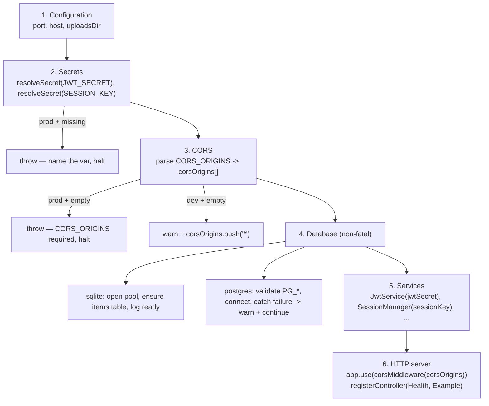
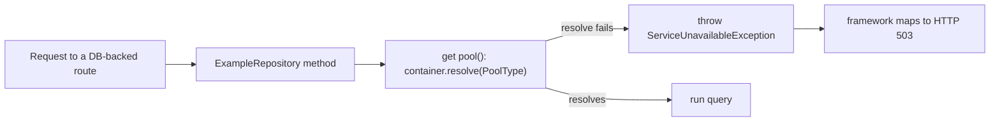

# Design Document

## Overview

This feature makes a freshly generated streetJS backend **secure-by-default** and **boots out-of-the-box**. The entire feature lives inside the project generator at `packages/cli/src/commands/create.ts`. The generator's `render*` methods each return a **template string** that is written verbatim to a file in the scaffolded project. There is **no streetjs runtime-library code to change** in this feature — the emitted templates only *reference* existing runtime exports (`ServiceUnavailableException`, `corsMiddleware`, `SqlitePool`/`PgPool`, `JwtService`, `SessionManager`).

The relevant emitting methods and their outputs:

| Method | Emits | `database` param |
| --- | --- | --- |
| `renderMainTs(database)` | `src/main.ts` | `'sqlite' \| 'postgres'` |
| `renderExampleRepository(database)` | `src/repositories/example.repository.ts` | `'sqlite' \| 'postgres'` |
| `renderEnvExample(database)` | `.env.example` | `'sqlite' \| 'postgres'` |
| `renderDockerCompose(database)` | `docker-compose.yml` | `'sqlite' \| 'postgres'` |

Most of the secure-by-default contract is already implemented and verified by the CLI test suite. This design records that established behavior as a contract to lock against regression, and specifies four small, surgical edits that close the remaining gaps. Per the project's working rules, the changes are minimal and confined to the four `render*` methods named above — no new files, no runtime-library changes, no scope expansion.

## Current State vs Target (Gap Analysis)

| Req | Behavior | On disk today | Action |
| --- | --- | --- | --- |
| R1 | Zero-config SQLite boot (`SqlitePool`, `CREATE TABLE IF NOT EXISTS items`, logs `Database ready (sqlite).`) | Satisfied in `renderMainTs('sqlite')` | Lock as contract — do not regress |
| R2 | Ephemeral dev secrets / prod fail-fast (`resolveSecret('JWT_SECRET',24)`, `resolveSecret('SESSION_KEY',32)`) | Satisfied in `renderMainTs` | Lock as contract |
| R3 | Graceful Postgres boot (validate `PG_*`, warn + continue, catch connect failure) | Satisfied in `renderMainTs('postgres')` | Lock as contract |
| R4 | HTTP 503 via lazy `get pool()` + `ServiceUnavailableException` | Satisfied in `renderExampleRepository` | Lock as contract |
| R5.1 / 5.3 / 5.4 | CORS resolver parses `CORS_ORIGINS`, dev-empty → `'*'` + warn, prod-empty → throw | Satisfied in `renderMainTs` (`corsOrigins` is computed) | Lock as contract |
| **R5.2** | App applies CORS middleware using the produced allowlist | **GAP** — emits `app.use(corsMiddleware(['*']));`; `corsOrigins` is computed but unused | **Fix** |
| R6.1 | SQLite `.env.example` has `CORS_ORIGINS` + comment | Satisfied in `renderEnvExample('sqlite')` | Lock as contract |
| **R6.2** | Postgres `.env.example` has `CORS_ORIGINS` + comment | **GAP** — only the sqlite variant has it | **Fix** |
| **R6.3** | SQLite `docker-compose.yml` app env has `CORS_ORIGINS` | **GAP** — absent | **Fix** |
| **R6.4** | Postgres `docker-compose.yml` app env has `CORS_ORIGINS` | **GAP** — absent | **Fix** |
| **R7** | `src/main.ts` carries an unauthenticated-example-routes notice | **GAP** — no such comment near the `registerController` calls | **Fix** |

Four actionable gaps: **R5.2**, **R6.2**, **R6.3+R6.4**, **R7**.

## Architecture

### Boot sequence of the emitted `main.ts` `bootstrap()`

The generated entry point runs a fixed-order bootstrap. Two phases are **fail-fast gates** that throw before the HTTP server binds; the database phase is **non-fatal** and degrades to HTTP 503.



The key invariant this design enforces: **`corsOrigins`, produced in phase 3, is the single source of truth that phase 6 must consume.** Today phase 6 ignores it and hardcodes `['*']` — that is gap R5.2.

### HTTP 503 path (unchanged, locked as contract)



Because the pool is resolved lazily inside `get pool()` (not in a field initializer), the repository constructs cleanly even when the database is unconfigured, and only signals 503 at query time.

## Components and Interfaces

All edits are to template strings inside `packages/cli/src/commands/create.ts`. Each is surgical and self-contained.

### 1. `renderMainTs(database)` — R5.2 (consume the allowlist)

The method already computes:

```ts
const corsOrigins = (process.env['CORS_ORIGINS'] ?? '')
  .split(',')
  .map((o) => o.trim())
  .filter((o) => o.length > 0);
// ... dev-empty pushes '*' + warn; prod-empty throws
```

In the HTTP-server phase, the emitted line changes from the hardcoded wildcard to the computed allowlist:

- Before: `app.use(corsMiddleware(['*']));`
- After:  `app.use(corsMiddleware(corsOrigins));`

No import changes (`corsMiddleware` is already imported). This is the only change needed for R5.2; it wires phase 3's output into phase 6.

### 2. `renderMainTs(database)` — R7 (unauthenticated-routes notice)

Add a comment immediately above the controller registration block:

```ts
// Register controllers
app.registerController(HealthController);
app.registerController(ExampleController);
```

The emitted comment must state that the example routes are **unauthenticated** and must be protected before public exposure, and point at the already-wired primitives the developer would use (`JwtService` / `SessionManager`, both registered in phase 5) and the generated `src/middleware/auth.ts`. Comment-only change; no behavioral change to routing (enforced auth on the example routes is explicitly out of scope).

### 3. `renderEnvExample(database)` — R6.2 (Postgres `.env.example` parity)

The Postgres branch's Security section currently ends after `SESSION_KEY`. Add a `CORS_ORIGINS` entry with the same explanatory comment already used in the SQLite branch, placed after `SESSION_KEY`:

```
# CORS — comma-separated allowlist of trusted origins. Leave empty in dev to
# allow all origins (*). REQUIRED in production (no wildcard fallback).
# Example: CORS_ORIGINS=https://app.example.com,https://admin.example.com
CORS_ORIGINS=
```

The value is emitted **empty** (see Design Decisions). This brings the Postgres variant to parity with the SQLite variant (R6.1 is already satisfied).

### 4. `renderDockerCompose(database)` — R6.3 + R6.4 (both compose variants)

Both the SQLite and Postgres branches define an `app` service whose `environment:` block currently ends with `JWT_SECRET` / `SESSION_KEY`. Add `CORS_ORIGINS` to each block. Both compose files set `NODE_ENV: development`, so an empty `CORS_ORIGINS` is valid (it produces the dev wildcard, not a prod fail-fast). Emit it empty with a one-line clarifying comment, e.g.:

```yaml
      # CORS allowlist (comma-separated). Empty in dev = allow all (*); set before deploying.
      CORS_ORIGINS: ""
```

This surfaces the knob in the compose environment without breaking dev boot.

### Out of scope (acknowledged, not changed)

`renderStreetConfig` emits `jwtSecret: ... ?? 'change-me-in-production'` and `sessionKey: ... ?? 'change-me-session-key'`. These defaults are **inert** for the Secret_Resolver contract: the emitted `main.ts` builds `JwtService`/`SessionManager` from `resolveSecret(...)`, not from these config fields. Changing them is out of scope for this feature and is intentionally left untouched.

## Design Decisions & Rationale

1. **Emit `CORS_ORIGINS` empty (not a sample value) in config files.** The dev-wildcard behavior is intentional and documented (R5.3): an empty value in `NODE_ENV=development` yields `'*'` with a warning. Emitting a sample origin would either break the documented zero-config dev boot or imply a real allowlist the developer didn't choose. The example value lives in the *comment*, so the knob is discoverable without changing behavior.

2. **DB phase stays non-fatal; secrets and CORS phases stay fail-fast.** The database can legitimately be unconfigured or unreachable during development (R3), so the app degrades to HTTP 503 (R4) rather than crashing. Secrets (R2.6) and CORS (R5.4) are security gates that *must* halt startup in production before the server binds — a running-but-insecure server is worse than a clear startup error.

3. **`corsOrigins` is the single source of truth.** R5.2 is fixed by consuming the already-computed `corsOrigins` rather than re-deriving the allowlist at the call site. This keeps the resolver logic (and its dev/prod branching) in one place.

4. **R7 is comment-only.** The requirement asks for a *notice*, not enforcement. Adding real auth to the example routes would change the scaffold's runtime behavior and the example's purpose, which is out of scope. The comment points developers to the primitives that already exist in the scaffold.

5. **Do not change `street.config.ts` secret defaults.** They are inert for this feature (see Out of scope). Silently changing them would be scope creep and could surprise existing generated projects; this design records the decision rather than acting on it.

## Error Handling

| Condition | Phase | Behavior | Requirement |
| --- | --- | --- | --- |
| `JWT_SECRET`/`SESSION_KEY` unset, dev | Secrets | Generate ephemeral key, `console.warn` dev-only notice | R2.3, R2.4, R2.5 |
| `JWT_SECRET`/`SESSION_KEY` unset, prod | Secrets | `throw` naming the missing var, halt startup | R2.6 |
| `CORS_ORIGINS` empty, dev | CORS | `corsOrigins.push('*')` + `console.warn` dev-only notice | R5.3 |
| `CORS_ORIGINS` empty, prod | CORS | `throw` indicating `CORS_ORIGINS` required, halt startup | R5.4 |
| `PG_USER`/`PG_PASSWORD`/`PG_DATABASE` missing | Database (postgres) | `console.warn` naming missing vars + guidance, continue without pool | R3.1 |
| Postgres connection attempt fails | Database (postgres) | `console.warn` failure + creds to check, close pool, continue serving | R3.2, R3.3 |
| DB pool unresolvable at query time | Request | `throw ServiceUnavailableException` → framework maps to HTTP 503 | R4.1, R4.2, R4.3 |

## Testing Strategy

These are **generator tests**: each scaffolds a project into a temp directory and reads the emitted files back, asserting on the template strings, matching the existing pattern in `packages/cli/src/tests/create.test.ts` and `create-database.test.ts` (`mkdtempSync` temp dir, `new CreateCommand().execute(ctx(...))`, `read(dir, proj, rel)`, `assert.ok(content.includes(...))`).

### Why not property-based testing

The feature emits **deterministic template strings** keyed on a single discrete parameter (`database` ∈ `{sqlite, postgres}`). There is no pure function with a large/infinite input space and no universal "for all inputs X, property P(X)" relationship to exercise — the output is fixed text per variant. This is configuration/code emission, best validated by example-based assertions on the emitted files (effectively snapshot-style content checks across the two variants). Property-based testing does not apply here; the Correctness Properties section is intentionally omitted.

### New assertions (gap coverage)

- **R5.2:** generated `src/main.ts` contains `corsMiddleware(corsOrigins)` and does **not** contain `corsMiddleware(['*'])` — for both `sqlite` and `postgres`.
- **R7:** generated `src/main.ts` contains the unauthenticated-example-routes notice (e.g. matches on "unauthenticated" / "protect" near the controller registration) — for both variants.
- **R6.2:** generated Postgres `.env.example` contains `CORS_ORIGINS` plus its explanatory comment.
- **R6.3:** generated SQLite `docker-compose.yml` contains `CORS_ORIGINS` in the `app` service `environment:` block.
- **R6.4:** generated Postgres `docker-compose.yml` contains `CORS_ORIGINS` in the `app` service `environment:` block.

### Regression-lock assertions (established contract)

- **R1:** SQLite `main.ts` contains `SqlitePool`, `CREATE TABLE IF NOT EXISTS items`, and the `Database ready (sqlite).` log.
- **R2:** `main.ts` contains `resolveSecret('JWT_SECRET', 24)` and `resolveSecret('SESSION_KEY', 32)` with dev-ephemeral + prod-throw branches.
- **R4:** `example.repository.ts` contains the lazy `get pool()` getter and `ServiceUnavailableException`.
- **R6.1:** SQLite `.env.example` retains its `CORS_ORIGINS` entry + comment.

### Whole-suite gate

Per the project's working rules, after the edits run `npm run build` then `npm test` in `packages/cli` and require **zero failures and zero skips**. Baseline before this change is 102 + 50 passing tests; the new assertions add to that baseline without removing any existing test.
