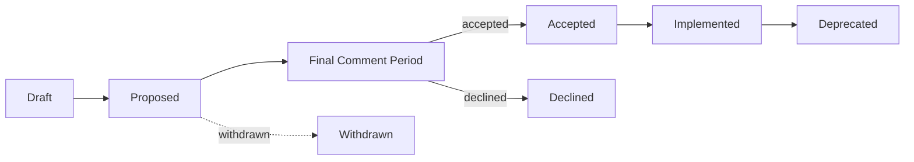

# StreetJS Framework — Governance

## Roles

- **Maintainers** — review/merge PRs, cut releases, own roadmap. Listed in
  `MAINTAINERS` (to be populated as the project grows).
- **Contributors** — anyone submitting issues/PRs under `CONTRIBUTING.md`.
- **Security responders** — handle private vulnerability reports.

## Decision-making

- Routine changes: maintainer review + green CI (`street certify` gate).
- Substantial changes (new public API, breaking change, new package): require an
  RFC (see below) and consensus of maintainers.

## RFC process

1. Open an RFC issue from the `rfc` template describing motivation, design,
   alternatives, backward-compatibility impact, and test/doc plan.
2. Discussion period (minimum 7 days).
3. Maintainer decision: Accepted / Rejected / Postponed, recorded in the issue
   and, for architectural choices, as an ADR under
   `docs/architecture-decision-records/`.
4. Implementation must satisfy the contribution bar: implementation + tests +
   docs + examples (+ benchmarks where applicable).

## Release process

- Versioning follows SemVer; changes recorded in `CHANGELOG.md`
  (Keep a Changelog format).
- CI (`.github/workflows/ci-cd.yml`) gates every release on build, lint,
  full test suites, certification suites, DB E2E, transport integration, and the
  benchmark regression gate. Tagged `v*.*.*` pushes publish with npm provenance.
- `street certify` produces `RELEASE-CERTIFICATION.md` + `certification-report.json`
  as the release evidence artifact.

## Security policy

- Report vulnerabilities privately (see `SECURITY.md` once published); do not
  open public issues for undisclosed vulnerabilities.
- Fixes ship in a patch release; advisories follow coordinated disclosure.

## Code of conduct

Participation is governed by a standard Contributor Covenant (to be added as
`CODE_OF_CONDUCT.md`).

---

## Steering Committee

The Steering Committee (SC) is the final decision-making body for cross-cutting
and contested matters.

- **Composition:** an **odd** number of seats (start at **3**, grow to 5/7 as the
  maintainer base grows) to avoid ties. Seats are held by Maintainers.
- **Election:** Maintainers nominate and vote; top vote-getters fill open seats
  for a **12-month term**. Terms are staggered so no more than half turn over at
  once. A seat vacated early is back-filled by the next-highest prior vote, else
  a by-election.
- **Voting rules:** SC decisions pass by **simple majority** of seated members; a
  quorum is a majority of seats. Votes and rationale are recorded publicly
  (except security/CoC matters, recorded privately).
- **Scope:** RFC final-comment-period calls, release-policy and governance
  changes, Code-of-Conduct appeals, and tie-breaking.
- **Conflict resolution:** disputes are first attempted via lazy consensus among
  Maintainers; if unresolved within a reasonable window, any Maintainer may
  refer the matter to the SC, which decides by majority vote. A member with a
  conflict of interest recuses (and is excluded from quorum for that vote).

## Maintainer responsibilities

- **Review expectations:** triage assigned issues/PRs within ~3 business days;
  give actionable, respectful feedback; do not merge your own non-trivial PRs
  without a second approval.
- **Release process:** follow `docs/RELEASE_CHECKLIST.md`; releases publish only
  from `v*` tags (and guarded `main` pushes) with provenance + SBOM; never bypass
  the version-match or provenance gates.
- **Security responsibilities:** participate in the private disclosure rotation
  per `SECURITY.md`; never discuss undisclosed vulnerabilities in public;
  coordinate patch releases and advisories.
- **Stewardship:** uphold backward-compatibility commitments, the RFC process,
  and the contribution bar (implementation + tests + docs + examples).

## RFC governance

The canonical RFC process and template live in [`rfcs/`](rfcs/README.md). RFCs
flow through this lifecycle:

- **Draft** — author fills the template; opens a PR.
- **Proposed** — a Maintainer assigns a number and labels it `rfc`; public discussion.
- **Final Comment Period** — a Maintainer proposes merge/close with a 7-day window
  and lazy consensus; the SC makes the call on unresolved disagreement.
- **Accepted** — merged; a tracking issue is opened for implementation.
- **Implemented** — the change has shipped (status updated in the RFC front-matter).
- **Deprecated** — a later RFC supersedes it (link the successor).
- **Declined / Withdrawn** — recorded with a one-line rationale.

**Every substantial or breaking change flows through this process.** (The
"RFC process" section above is the historical summary; `rfcs/` is authoritative.)

