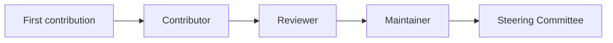

# Contributor Path

Four roles, each a superset of the last. Advancement is by demonstrated work and
nomination — never by tenure alone.

## 1. First contribution (target: < 30 minutes to first PR)

1. Read `CONTRIBUTING.md` and install Node 20+.
2. `git clone` → `npm ci` → `npm run build -w packages/core`.
3. Pick a [`good-first-issue`](https://github.com/hassanmubiru/StreetJS/labels/good-first-issue)
   (each is scoped, has acceptance criteria, and a mentor where labeled
   `mentorship-available`).
4. Make the change, run the relevant package's tests (`npm test -w packages/<pkg>`),
   open a PR. CI runs lint/typecheck/tests automatically.

You are a **Contributor** after your first merged PR.

## 2. Reviewer

**Bar:** ~10 quality PRs and/or substantive reviews in an area; consistent,
constructive feedback; understands an area's tests and conventions.

**Rights:** may `Approve` PRs in their area (approval is advisory until a
Maintainer merges). Listed in `CODEOWNERS` for that area.

**Nomination:** any Maintainer; lazy consensus among Maintainers.

## 3. Maintainer

**Bar:** sustained reviewing + ownership of an area; demonstrates judgment on
backward-compatibility and security; follows the release process.

**Rights/Responsibilities:** merge rights; triage; participate in security
response; uphold the RFC process. See `GOVERNANCE.md` for the full responsibility
list.

**Nomination:** by **two** existing Maintainers; confirmed by Steering Committee.

## 4. Steering Committee

**Bar:** Maintainer with cross-cutting impact and a track record of sound
decisions.

**Role:** final-comment-period calls on RFCs, tie-breaking votes, governance and
release-policy decisions, Code-of-Conduct appeals. Structure, size, and election
are defined in `GOVERNANCE.md`.

## Recognition

- All merged contributors are credited (all-contributors).
- Notable contributions are highlighted in release notes and Announcements.
- Moving up a rung is announced publicly.

## Stepping back

Any role may step back at any time (emeritus status). Inactivity for two release
cycles moves a Maintainer to emeritus by default; re-activation is immediate on
request.
